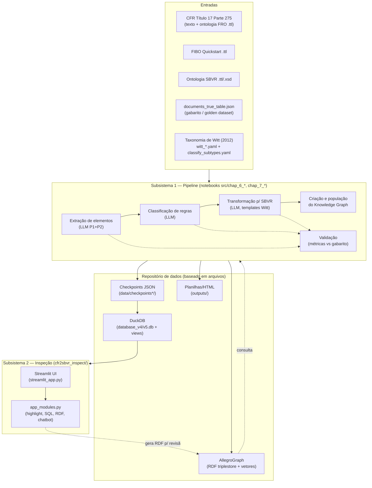
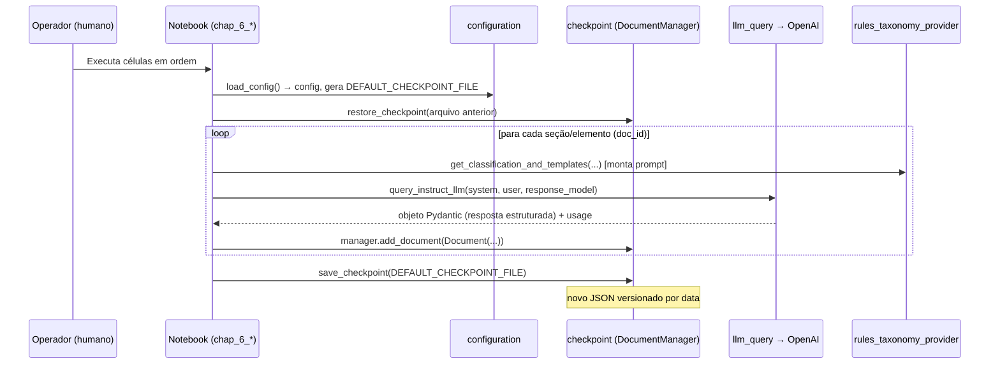
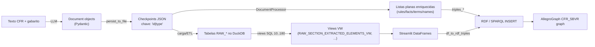

# 01 — Arquitetura

Este documento descreve a arquitetura do sistema CFR2SBVR: seus componentes, os fluxos de controle e
de dados, e as decisões estruturais implícitas no código.

## 1. Visão geral em uma imagem

O sistema é, na prática, dois subsistemas fracamente acoplados que compartilham um repositório de
dados baseado em arquivos:

**Leitura:** o pipeline (notebooks) produz checkpoints JSON; esses checkpoints são carregados em
DuckDB (materializados em views SQL) para alimentar o aplicativo de inspeção Streamlit; em paralelo, o
pipeline popula um Knowledge Graph no AllegroGraph. O gabarito (`documents_true_table.json`) e a
taxonomia de Witt alimentam tanto a execução quanto a validação.

## 2. Componentes

### 2.1 Subsistema 1 — Pipeline de processamento (`src/`)

O pipeline é implementado como uma **sequência de notebooks Jupyter** (`chap_6_*` = capítulo 6 da
dissertação = método; `chap_7_*` = capítulo 7 = validação). Cada notebook é um estágio executável
manualmente, na ordem definida no [README do código](../README.md):

| Ordem | Notebook | Responsabilidade |
|-------|----------|------------------|
| 1 | `chap_6_cfr2sbvr_modules.ipynb` | Gera/consolida os módulos Python de apoio |
| 2 | `chap_6_semantic_annotation_elements_extraction.ipynb` | **Extração** de termos, nomes, fatos, fact types e regras do texto do CFR (LLM, duas passagens P1/P2) |
| 3 | `chap_6_semantic_annotation_rules_classification.ipynb` | **Classificação** dos elementos segundo a taxonomia de Witt (tipo/subtipo) |
| 4 | `chap_6_nlp2sbvr_transform.ipynb` | **Transformação** dos elementos em declarações SBVR usando templates |
| 5 | `chap_6_create_kg.ipynb` | Cria o repositório AllegroGraph e carrega ontologias (FIBO/CFR/SBVR) + índices vetoriais |
| 6 | `chap_6_nlp2sbvr_elements_association_creation.ipynb` | **Associa** os elementos SBVR extraídos a conceitos FIBO/CFR (busca semântica) e popula o grafo |
| 7–9 | `chap_7_validation_*.ipynb` | **Validação** de extração, classificação e transformação contra o gabarito |

Notebooks auxiliares: `chap_6_create_kg`, `chap_6_nlp2sbvr_elements_association_creation_best`,
`chap_7_validation_support`, `chap_7_*_cumulative` (variações de análise agregada).

Os notebooks dependem de **seis módulos Python** reutilizáveis (o único código verdadeiramente
"biblioteca" do projeto):

| Módulo (`src/<nome>/main.py`) | Papel | Símbolos-chave |
|-------------------------------|-------|----------------|
| `configuration` | Carrega `config.yaml` (YAML), injeta `OPENAI_API_KEY` do ambiente, gera nomes de arquivos versionados por data (`documents-YYYY-MM-DD-N.json`) | `load_config`, `get_next_filename`, `get_last_filename` |
| `checkpoint` | **Modelo de domínio** (`Document`, `DocumentManager`) + persistência JSON + `DocumentProcessor` que agrega/enriquece elementos entre estágios | `Document`, `DocumentManager`, `DocumentProcessor`, `restore_checkpoint`, `save_checkpoint`, `get_elements_from_checkpoints` |
| `llm_query` | Chamada única ao LLM da OpenAI, com saída estruturada via `instructor` e medição de tempo | `query_instruct_llm`, `measure_time` |
| `token_estimator` | Estimativa de tokens (custo/limite de contexto) | `estimate_tokens` (tiktoken) |
| `logging_setup` | Logging para arquivo rotativo diário + console | `setting_logging` |
| `rules_taxonomy_provider` | Lê os YAML da taxonomia de Witt e renderiza Markdown de subtipos/templates para injetar nos prompts | `RuleInformationProvider`, `RulesTemplateProvider` |

> **Observação de acoplamento:** `rules_taxonomy_provider` existe **duplicado** em
> `src/rules_taxonomy_provider/` e em `cfr2sbvr_inspect/rules_taxonomy_provider/` — duas cópias que
> podem divergir. Ver [06-modernizacao.md](06-modernizacao.md).

### 2.2 Subsistema 2 — Aplicativo de inspeção (`cfr2sbvr_inspect/`)

Aplicativo **Streamlit** que permite a especialistas (SMEs) navegar pelos checkpoints, comparar
statements candidatos, visualizar classificações/transformações com destaque semântico (termos, nomes,
verb symbols, keywords) e marcar as "melhores opções", gerando triples RDF para revisão.

| Arquivo | Papel |
|---------|-------|
| `streamlit_app.py` | UI, sidebar de filtros (processo, tabela, doc_id, checkpoint), tabela de dados, abas *Compare*/*Feedback* |
| `app_modules.py` | Toda a lógica: conexão DuckDB (`db_connection`), consultas (`load_data`, `get_*`), realce de statements (`highlight_statement`), similaridade Levenshtein (`jellyfish`), geração de RDF (`triples_*`, `df_to_rdf_triples`), chatbot OpenAI (`chatbot_widget`) |
| `rules_taxonomy_provider/main.py` | Renderização Markdown da taxonomia de Witt para diálogos informativos |
| `data/db_objects_v4/`, `db_objects_v5/` | **Definições das views SQL** (numeradas 10..180) que reprojetam os checkpoints em um modelo relacional |
| `data/*.db` | Bancos DuckDB materializados por execução (v4/v5) |

O aplicativo lê configuração via `st.secrets` **ou** variáveis de ambiente (`get_config`/`get_secret`),
e pode apontar para um DuckDB **local** (`database_v5.db`) ou para o **MotherDuck** cloud
(`md:cfr2sbvr_db`).

### 2.3 Utilitários e experimentos

- `scripts/` — shell scripts para exportar/importar o repositório AllegroGraph em N-Quads
  (`agtool export/load`) e especificações `.def` para indexação vetorial (embeddings OpenAI
  `text-embedding-3-small`).
- `src/sbvr_xsd_to_rdf.py` — CLI que converte o XSD do SBVR em RDF (usa `defusedxml` por segurança).
- `labs/` — protótipos (ex.: `nl2sql_demo`, `cnl_sbvr_pim_model`, notebooks `lab_1..15`). **Não fazem
  parte do fluxo de produção**; devem ser tratados como material de referência/descartável na
  modernização.

## 3. Fluxo de controle (como o pipeline "roda")

O pipeline **não tem orquestrador**. A execução é manual, notebook a notebook, na ordem do README. O
padrão de controle interno de cada notebook `chap_6_*` é consistente:

Pontos-chave do controle:

- **Idempotência por checkpoint:** cada estágio restaura o checkpoint do estágio anterior, adiciona
  seus resultados como novos `Document`s (chaveados por `(id, type)`) e persiste um **novo** arquivo
  `documents-YYYY-MM-DD-N.json`. O número `N` é incrementado automaticamente por
  `configuration.get_next_filename`.
- **Saída estruturada garantida:** `llm_query` usa a biblioteca `instructor` sobre o cliente OpenAI
  (`create_with_completion`) com `response_model` sendo um `BaseModel` Pydantic — a resposta do LLM é
  validada contra o schema antes de virar `Document`.
- **Determinismo tentado:** `temperature=0`, `top_p=1`, `frequency_penalty=0`, `presence_penalty=0`.
- **Detecção de ambiente:** cada notebook detecta Colab (`'google.colab' in sys.modules`) e, se
  aplicável, monta o Drive, clona o repositório e troca `config.yaml` pela versão Colab.

## 4. Fluxo de dados (como o estado "viaja")

Há **duas representações paralelas** dos mesmos dados, o que é central para entender o sistema:

1. **Objetos → JSON:** `DocumentManager.persist_to_file` serializa o dicionário de documentos,
   convertendo a chave tupla `(id, type)` em string `"id|type"` e `set`→`list`.
2. **JSON → listas enriquecidas:** `DocumentProcessor` (em `checkpoint/main.py`) lê um checkpoint e
   reconstrói, por cruzamento entre documentos, as coleções `elements_rules`, `elements_facts`,
   `elements_terms`, `elements_names`, aplicando classificações (`process_*_classifications`),
   transformações (`process_transformed_elements`) e validações (`process_validations`). É aqui que a
   "planilha lógica" de cada elemento é montada em memória.
3. **JSON → DuckDB:** os checkpoints são carregados em tabelas `RAW_*` e as **views SQL numeradas**
   (`10_RAW_SECTION_EXTRACTED_ELEMENTS_VW.sql` … `180_...`) fazem o mesmo trabalho de cruzamento, mas
   em **SQL**, produzindo as views que o Streamlit consome. Ou seja, a mesma lógica de junção existe
   **duas vezes**: em Python (`DocumentProcessor`) e em SQL (views).
4. **Listas/DataFrame → RDF:** `app_modules.triples_term_and_name`, `triples_rule_and_fact` e
   `triples_verb_symbol` traduzem cada elemento em triplas RDF nos namespaces SBVR/CFR-SBVR/FRO-CFR;
   `generate_insert_sparql_query` gera o `INSERT DATA` para o grafo `cfr-sbvr:CFR_SBVR`.

> **Consequência arquitetural:** existem **dois pipelines de agregação** (Python e SQL) que precisam
> permanecer sincronizados manualmente. Divergências entre eles são uma fonte provável de bugs e um
> alvo prioritário da modernização.

## 5. Modelo de domínio (essência)

O núcleo conceitual está em `checkpoint/main.py`:

- **`Document`** (Pydantic): unidade genérica de armazenamento — `id`, `type`, `content` (qualquer
  coisa: dict, list, str), mais `elapsed_times` e `completions` (metadados do LLM). O par `(id, type)`
  é a chave primária lógica.
- **`DocumentManager`**: coleção de `Document`s indexada por `(id_normalizado, type_normalizado)`.
  Normaliza strings com Unicode NFKD (`normalize_str`) — necessário porque os `doc_id` contêm o símbolo
  de seção `§` e caracteres não-ASCII vindos do texto legal.
- **`DocumentProcessor`**: o "motor de leitura" que transforma o armazenamento genérico
  chave-valor em coleções tipadas de regras/fatos/termos/nomes prontos para análise ou geração de RDF.

Os **tipos de documento** (`type`) usados como convenção incluem: `section`, `llm_response`,
`llm_response_classification`, `llm_response_transform`, `llm_validation`, `true_table`. Os `id`
seguem convenções como `§ 275.0-2_P1`, `classify_P1`, `classify_P2_Operative_rules`,
`transform_Fact_Types`, `validation_judge_Terms` (ver [04-modelo-de-dados.md](04-modelo-de-dados.md)).

## 6. Padrões e decisões arquiteturais observadas

| Decisão | Evidência no código | Implicação para modernização |
|---------|---------------------|------------------------------|
| **Notebook-como-aplicação** | Toda a lógica de pipeline vive em `chap_6_*.ipynb` | Difícil de testar, versionar, automatizar; extrair para módulos/serviços |
| **Estado via arquivos versionados por data** | `get_next_filename`, `checkpoints*/documents-*.json` | Sem banco transacional; reprodutibilidade depende de convenção de nomes |
| **Saída de LLM validada por schema** | `instructor` + Pydantic em `llm_query` | Bom padrão; manter na nova arquitetura |
| **Config única em YAML com segredos embutidos** | `config.yaml` | Risco de segurança (ver infra); migrar para secret manager |
| **Dupla materialização (JSON + DuckDB/SQL)** | `DocumentProcessor` vs views `db_objects_v*` | Fonte de duplicação de lógica; unificar |
| **Duas "versões" de processo (v4/v5)** | `db_objects_v4` vs `db_objects_v5`, texto do `info_dialog` | Semânticas de encadeamento diferentes; decidir qual persiste |
| **KG como destino final, não fonte** | notebooks de KG só no fim; app gera RDF por revisão | O AllegroGraph é opcional para o app rodar |
| **Acoplamento a fornecedores** | OpenAI (LLM+embeddings), Franz AllegroGraph, MotherDuck | Pontos de lock-in a avaliar |

Continua em [02-infraestrutura.md](02-infraestrutura.md).
