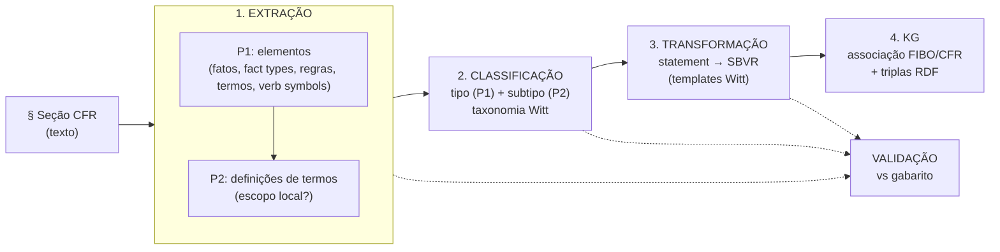

# 03 — Funcional (o pipeline em detalhe)

Este documento descreve **o que o sistema faz**, estágio a estágio, com as estruturas de entrada e
saída de cada um, os prompts/modelos de LLM envolvidos e os critérios de avaliação. É a referência
para preservar o comportamento durante a rearquitetura.

## 0. O problema de domínio

O CFR (Code of Federal Regulations), Título 17, Parte 275, regula *Investment Advisers* nos EUA. O
texto é **linguagem natural jurídica**, com seções como `§ 275.0-2`, parágrafos `(a)`, `(b)(1)`, etc.
O objetivo do sistema é convertê-lo em **regras de negócio formais** no padrão **SBVR** (Semantic
Business Vocabulary and Rules), classificadas segundo a **taxonomia de Graham Witt (2012)**, e
integrá-las a um Knowledge Graph junto de FIBO e da própria ontologia do CFR (FRO).

Conceitos SBVR manipulados: **Term** (substantivo comum / conceito geral), **Name** (substantivo
próprio / conceito individual), **Fact / Fact Type** (relações entre termos), **Operative Rule**
(regra comportamental/obrigacional), **Verb Symbol** (símbolo verbal), **Definitional Rule**.

## 1. Pipeline em quatro estágios (+ KG e validação)



Todos os estágios seguem o mesmo idioma: **restaurar checkpoint anterior → montar prompts → chamar LLM
com saída Pydantic → adicionar `Document`s → salvar novo checkpoint** (ver
[01-arquitetura.md §3](01-arquitetura.md#3-fluxo-de-controle-como-o-pipeline-roda)).

---

## 2. Estágio 1 — Extração de elementos

**Notebook:** `chap_6_semantic_annotation_elements_extraction.ipynb`
**Entrada:** `Document(type="section")` — texto integral de cada seção CFR.
**Saída:** `Document(type="llm_response")` com id `§ ..._P1` e `§ ..._P2`.

É executado em **duas passagens** por seção:

### P1 — Extração de elementos e relacionamentos
Um único `system_prompt` (evoluiu por versões `v1`→`v3`→`v4_1`; a versão ativa é a última) instrui o
LLM a:
1. Resumir o documento (para autoverificação de cobertura);
2. Identificar **Fact**, **Fact Type**, **Operative Rule**;
3. Extrair, para cada elemento: `statement`, `title`, `sources` (parágrafos), `terms` (com
   classificação Common/Proper Noun), `verb_symbols`, e a `classification` (Fact/Fact Type/Operative
   Rule) com `confidence` e `reason`.

O `response_model` é `ElementsDocumentModel` (contém `elements: List[...]`, cada um com `Item`s de
termos). O prompt do usuário é apenas o texto da seção (`# Document\n{content}`).

### P2 — Definições de termos e escopo
Para os termos extraídos, o LLM produz `Term`s com:
- `definition` (texto da definição, se presente na seção),
- `confidence` + `reason`,
- `isLocalScope` (booleano) + `local_scope_confidence` + `local_scope_reason` — indica se o termo é
  definido **localmente** (naquela seção) ou tem escopo global (usado em `define_vocabulary_ns` para
  decidir o namespace do vocabulário: `cfr-sbvr:..._NS` vs. `fro-cfr:...Part_275_NS`).

### Gabarito
As entradas `*_P1|true_table` e `*_P2|true_table` de `documents_true_table.json` são carregadas no
`DocumentManager` para comparação (validação da extração no cap. 7).

> Seções cobertas pelo gabarito/execução: `§ 275.0-2`, `§ 275.0-5`, `§ 275.0-7` (ver
> `checkpoints_metadata.csv`). O conjunto de dados é pequeno e propositalmente curado (pesquisa).

---

## 3. Estágio 2 — Classificação de regras

**Notebook:** `chap_6_semantic_annotation_rules_classification.ipynb`
**Entrada:** elementos extraídos (P1/P2).
**Saída:** `Document(type="llm_response_classification")` com ids `classify_P1`,
`classify_P2_Operative_rules`, `classify_P2_Definitional_facts/terms/names`.

Classificação em **dois níveis** segundo Witt (2012):

### P1 — Tipo (nível topo da taxonomia)
`response_model` = `Classification` (`type`, `confidence∈[0,1]`, `explanation`). O tipo de topo
separa, p.ex., **Definitional rules** vs **Operative rules**.

### P2 — Subtipo (nível folha)
`response_model` = `SubClassification` (`subtype` = título da (sub)seção da taxonomia,
`templates_ids` = templates de Witt que casaram, `confidence`, `explanation`).

O prompt de subtipo é **construído dinamicamente** por
`get_system_prompt_classify_p2(element_count, element_type, rule_type, statement_type)`, que usa
`RuleInformationProvider.get_classification_and_templates(statement_type)` para injetar, em Markdown, a
definição do subtipo + seus templates + exemplos (lidos de `classify_subtypes.yaml`,
`witt_templates.yaml`, `witt_examples.yaml`).

### Agregação por confiança
Na leitura (`DocumentProcessor.process_operative_rules_classifications`,
`process_facts/terms/names_classifications`), quando há múltiplas classificações para o mesmo
`(doc_id, statement_id)`, **vence a de maior `confidence`**. Tipo vem de `classify_P1`; subtipo de
`classify_P2_*`. Definitional facts/terms/names têm `type` fixado em `"Definitional"`.

> **Regra de qualidade (app):** `QUALITY_THRESHOLD = 0.8`. Confianças abaixo disso são exibidas em
> vermelho na UI de inspeção.

---

## 4. Estágio 3 — Transformação para SBVR

**Notebook:** `chap_6_nlp2sbvr_transform.ipynb`
**Entrada:** elementos classificados (com `templates_ids`).
**Saída:** `Document(type="llm_response_transform")` com ids `transform_Fact_Types`,
`transform_Operative_Rules`, `transform_Terms`, `transform_Names`.

Para cada elemento, `get_prompts_for_rule(rules, rule_template_formulation, data_dir)` usa
`RulesTemplateProvider.get_rules_template(template_ids, return_forms)` para recuperar as **formas de
template** de Witt (`rule_form`, `fact_type_form`, `form`) — incluindo subtemplates encadeados
(`usesSubtemplate`, resolvidos recursivamente sem duplicar). O LLM então reescreve o `statement`
original em **SBVR estruturado** aderente ao template.

`response_model` = `TransformedStatement` — campos: `doc_id`, `statement_id`, `statement_title`,
`transformed` (o texto SBVR), `confidence`, `reason`, `templates_ids`, `statement_sources`.

Na leitura, `DocumentProcessor.process_transformed_elements` casa cada transformação com o elemento
correspondente por `(doc_id, statement_id, sources)` e injeta o campo `transformed`.

> **Não há gabarito de transformação.** A qualidade é medida por dois métodos independentes no cap. 7
> (SEMSCORE e LLM-as-a-judge), descritos na seção 7.

### Templates de Witt (o que são)
`witt_templates.yaml` define templates `T1`, `T2`, … com `rule_form` em CNL, p.ex.:
```
{Each|The} <operative rule statement subject>
  must <rule statement predicate>
  {{if|unless} <conditional clause>|}.
```
`witt_subtemplates.yaml` define subcomponentes (`S*`) e
`witt_template_subtemplate_relationship.yaml` liga templates a subtemplates. `classify_subtypes.yaml`
mapeia cada subtipo da taxonomia (ex.: *Formal intensional definitions* `9.2.1.1`) aos templates e
exemplos que o caracterizam.

---

## 5. Estágio 4 — Knowledge Graph (criação, associação e população)

### 5.1 Criação do KG — `chap_6_create_kg.ipynb`
1. Conecta ao AllegroGraph (local ou cloud via stunnel) com `franz.openrdf.connect.ag_connect`.
2. Guarda de segurança: aborta se o repositório **não** estiver vazio, salvo `ALLEGROGRAPH_FORCE_RUN`;
   se `ALLEGROGRAPH_CLEAN_BEFORE_RUN`, executa `conn.clear()`.
3. Carrega ontologias em **grafos nomeados** distintos (`conn.addFile(..., context=<graph>)`):
   - `US_LegalReference.ttl`, `Code_Federal_Regulations.ttl`, `FRO_CFR_Title_17_Part_275.ttl` → grafo
     `...#CFR_Title_17_Part_275`
   - `prod-fibo-quickstart-2024Q3.ttl` → grafo `...#FIBO`
   - `sbvr-...-ontology-v1.ttl` → grafo `...#SBVR_Onto`
4. **Indexa vetores** com `agtool llm index` usando as specs `.def` (`fibo-vec.def`,
   `cfr-sbvr-vec.def`): embeddings OpenAI `text-embedding-3-small` sobre `rdfs:label`/`sbvr:signifier`
   de classes/indivíduos/termos, gerando os vector stores `fibo-glossary-3m-vec` e `cfr-sbvr-3m-vec`.
   A chave OpenAI é injetada temporariamente no `.def` e removida depois.

### 5.2 Associação e população — `chap_6_nlp2sbvr_elements_association_creation.ipynb`
- Para cada Term/Name SBVR extraído, faz **busca semântica** nos vector stores FIBO/CFR para achar
  conceitos equivalentes, gerando `skos:exactMatch` (quando similaridade ≥ `SIMILARITY_THRESHOLD`,
  0.85) ou `skos:closeMatch`.
- Gera as triplas SBVR e as insere no grafo `cfr-sbvr:CFR_SBVR` via SPARQL `INSERT DATA`.
- A lógica de tradução elemento→RDF é a mesma reutilizada pelo app (`app_modules.triples_*`); ver
  [04-modelo-de-dados.md §4](04-modelo-de-dados.md#4-ontologia--modelo-rdfsbvr).
- Variante `_best` prioriza as "melhores opções" marcadas por SMEs.

### 5.3 Export/import
`scripts/export-cfr2sbvr-repo-to-nquad.sh` e `import-...sh` usam `agtool export/load` para mover o
repositório inteiro como N-Quads comprimidos (backup/migração entre ambientes).

---

## 6. Aplicativo de inspeção (validação humana)

**`cfr2sbvr_inspect/streamlit_app.py` + `app_modules.py`.** Não é um estágio do pipeline, mas o
instrumento de **revisão por especialistas (SMEs)**:

- **Sidebar:** escolha de processo (Extraction/Classification/Transformation/Validation), tabela
  (view DuckDB correspondente), `doc_id`(s), fontes de statement e checkpoint(s).
- **Tabela de dados:** carregada de uma view DuckDB (`load_data` monta SQL com filtros); linhas do
  gabarito (`documents_true_table.json`) são destacadas em verde.
- **Aba Compare:** até 4 statements lado a lado, com:
  - realce semântico (`highlight_statement`): keywords SBVR em laranja, termos sublinhados, nomes
    sublinhados-duplos, verb symbols em itálico azul; termos com tooltip (definição, escopo, scores);
  - links para a fonte no ecfr.gov;
  - detalhes de classificação (tipo/subtipo, confiança, explicação, templates) e transformação
    (confiança, razão, SEMSCORE, similarity score, accuracy, findings);
  - **distância de Levenshtein** entre pares (`jellyfish`) para comparar redações.
- **Aba Feedback:** SME marca as "melhores opções"; `df_to_rdf_triples` gera o Turtle correspondente
  (Terms/Names, Rules/Facts e Verb Symbols) para revisão/inserção.
- **Chatbot** (`chatbot_widget`): assistente GPT-4o com sugestões de prompt para melhorar títulos/
  explicar statements.

---

## 7. Validação (capítulo 7) — como a qualidade é medida

Notebooks `chap_7_validation_*` (+ variantes `_cumulative` e `_support`). Três frentes:

### 7.1 Extração e classificação — contra o gabarito
Comparam elementos preditos vs. `true_table` casando por `(doc_id, statement_id, sources)`. Produzem
métricas de concordância e planilhas em `outputs/` (`comparison_*_results.xlsx`,
`P1_summary_true_table.xlsx`, `p1_true_pred_results.xlsx`, `combined_analysis_results.xlsx`) e
relatórios HTML (`chap_7_validation_elements_extraction.html`, `..._rules_classification.html`).

### 7.2 Transformação — **sem gabarito**, dois métodos independentes
Como não há "resposta certa" única para uma reescrita em SBVR, usa-se:

1. **SEMSCORE** (Aynetdinov & Akbik, 2024) — `semscore`: similaridade semântica por embeddings entre
   o statement transformado e o original. *"Operação cara"* (nota no notebook).
2. **LLM-as-a-judge** (Zheng et al. 2023; Wei et al. 2024; Dong et al. 2024) — um LLM atua como juiz
   (`get_system_prompt_judge_sentence_similarity`) e produz `JudgeStatement` com: `similarity_score`,
   `similarity_score_confidence`, `transformation_accuracy`, `grammar_syntax_accuracy`, `findings`.
   Persistido como `Document(type="llm_validation")` (ids `validation_judge_Operative_Rules`,
   `_Fact_Types`, `_Terms`, `_Names`).

Classificação de similaridade (`classify_similarity`): `1.0`=*identical*, `≥0.9`=*close-match*, etc.

### 7.3 Análise estatística das duas métricas
O notebook de transformação faz uma análise robusta de concordância entre `semscore` e
`similarity_score`:
- estatísticas descritivas por `element_type` (`describe()` → `sem_sim_descriptive_stats.xlsx`);
- correlações **Pearson, Spearman e Kendall's Tau** (monotonicidade);
- concordância dentro de margem ±0.01 e ±0.10; diferença `score_difference`;
- identificação dos piores casos (`nsmallest`) para inspeção manual;
- gráficos (histogramas lado a lado, dispersão, produto dos escores).

Saídas em `outputs/`: `similarity_score_confidence_descriptive_stats.xlsx`,
`transformation_accuracy_grammar_descriptive_stats.xlsx`, `misaligned_similarity.xlsx`,
`sem_sim_descriptive_stats.xlsx`, etc.

`DocumentProcessor.process_validations` reinjeta esses escores nos elementos (por
`(doc_id, statement_id, sources)`), fechando o ciclo para exibição no app e geração de RDF (os escores
viram propriedades `cfr-sbvr:transformation*` nas triplas).

---

## 8. Versões de processo (v4 vs. v5)

O sistema tem **duas semânticas de encadeamento** entre estágios, materializadas em bancos e conjuntos
de views distintos (`db_objects_v4` vs `db_objects_v5`; `database_v4.db` vs `database_v5.db`). Do
diálogo de ajuda do app (`app_modules.info_dialog`):

- **v4 (`database_v4.db`):** o **gabarito (true table)** é usado como entrada de cada processo após a
  extração. Isola o erro de cada estágio (avalia cada etapa independentemente).
- **v5 (`database_v5.db`):** o **checkpoint de saída de um processo** é a entrada do próximo
  (encadeamento realista/ponta-a-ponta, com propagação de erro).

> Decisão pendente para a modernização: qual semântica preservar como padrão. v5 reflete produção;
> v4 é instrumento de avaliação por etapa. Ver [06-modernizacao.md](06-modernizacao.md).

## 9. Resumo entrada→saída por estágio

| Estágio | Entrada (`type`) | Saída (`type`) | `response_model` | Sem LLM? |
|---------|------------------|----------------|------------------|----------|
| Extração P1 | `section` | `llm_response` (`*_P1`) | `ElementsDocumentModel` | não |
| Extração P2 | `section` + P1 | `llm_response` (`*_P2`) | `Term`/`ElementsDocumentModel` | não |
| Classificação P1 | `llm_response` | `llm_response_classification` (`classify_P1`) | `Classification` | não |
| Classificação P2 | `llm_response` | `llm_response_classification` (`classify_P2_*`) | `SubClassification` | não |
| Transformação | classificados | `llm_response_transform` (`transform_*`) | `TransformedStatement` | não |
| KG associação | transformados | triplas RDF no AG | — (SPARQL) | busca vetorial (embeddings) |
| Validação (juiz) | transformados | `llm_validation` (`validation_judge_*`) | `JudgeStatement` | não |
| Validação (SEMSCORE) | transformados | escores `semscore` | — | embeddings |

Continua em [04-modelo-de-dados.md](04-modelo-de-dados.md).
