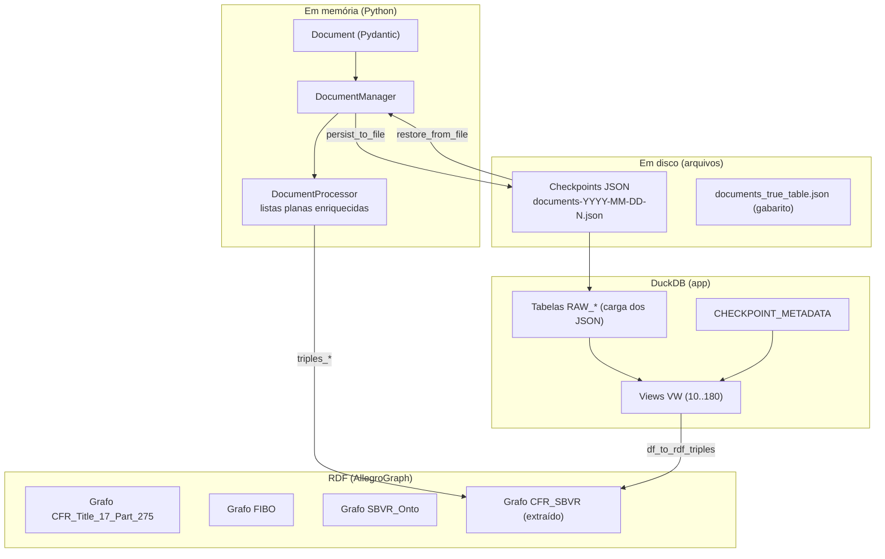

# 04 — Modelo de Dados

Este documento cataloga **todas as representações de dados** do sistema. É essencial para a
modernização porque os mesmos dados existem em **três formas** (objetos Pydantic, checkpoints JSON,
tabelas/views DuckDB) mais o **grafo RDF** final.

## 1. Visão de conjunto

## 2. Modelo em memória (Pydantic) — `checkpoint/main.py`

### 2.1 `Document`
Unidade genérica de armazenamento (chave–valor tipada):

| Campo | Tipo | Descrição |
|-------|------|-----------|
| `id` | `str` | Identificador lógico (ex.: `§ 275.0-2`, `§ 275.0-2_P1`, `classify_P1`, `transform_Terms`) |
| `type` | `str` | Categoria do documento (ver §2.3) |
| `content` | `Any` | Conteúdo — dict, list, str; formato depende de `type` |
| `elapsed_times` | `list[float]?` | Tempos das chamadas de LLM que geraram o conteúdo |
| `completions` | `list[Dict]?` | Metadados de `usage`/completion do LLM |

### 2.2 `DocumentManager`
Coleção `Dict[(id, type) → Document]`. Chave é a **tupla normalizada** `(normalize_str(id),
normalize_str(type))` (Unicode NFKD, necessário por causa de `§` e afins). Operações: `add_document`,
`retrieve_document`, `list_document_ids(doc_type)`, `exclude_document`, `persist_to_file`,
`restore_from_file`.

**Serialização:** ao persistir, a chave tupla vira string `"id|type"` e `set`→`list`
(`convert_set_to_list`). Ao restaurar, `"id|type".split("|")` reconstrói a tupla.

> ⚠️ **Fragilidade conhecida:** a chave usa `|` como separador. Se um `id` ou `type` contiver `|`, o
> `split("|")` corromperá a chave. Além disso `split("|")[0]`/`[1]` ignora um terceiro segmento
> eventual. Anotado para a modernização.

### 2.3 Convenção de `type` e `id`

| `type` | `id` exemplos | `content` |
|--------|---------------|-----------|
| `section` | `§ 275.0-2` | texto integral da seção (str) |
| `llm_response` | `§ 275.0-2_P1`, `§ 275.0-2_P2` | P1: `{section, elements:[...]}`; P2: `{terms:[...]}` |
| `llm_response_classification` | `classify_P1`, `classify_P2_Operative_rules`, `classify_P2_Definitional_facts/terms/names` | `[{doc_id, statement_id, classification:[...]}]` |
| `llm_response_transform` | `transform_Fact_Types`, `transform_Operative_Rules`, `transform_Terms`, `transform_Names` | `[{doc_id, statement_id, transformed, ...}]` |
| `llm_validation` | `validation_judge_Operative_Rules`, `_Fact_Types`, `_Terms`, `_Names` | `[{doc_id, statement_id, semscore, similarity_score, ...}]` |
| `true_table` | `§ 275.0-2_P1`, `classify_P1`, `classify_P2_*` | mesmas formas, porém curadas (gabarito) |

### 2.4 `DocumentProcessor` — as coleções enriquecidas
Ao instanciar sobre um `DocumentManager`, popula (em memória) listas planas prontas para análise:

- `elements_rules`, `elements_facts` — regras e fatos (de P1), com título, statement, sources, terms,
  verb_symbols, e (após enriquecimento) `type/subtype/confidence/explanation/templates_ids`.
- `elements_terms`, `elements_names` — termos (Common Noun) e nomes (Proper Noun), com `definition`,
  `isLocalScope`, sources.
- `*_classifications` — classificações agregadas por maior confiança.
- Enriquecimentos aplicados na leitura: `process_transformed_elements` (injeta `transformed`),
  `process_validations` (injeta `semscore`, `similarity_score`, `transformation_accuracy`,
  `grammar_syntax_accuracy`, `findings`), `merge_terms`/`merge_names` (dedup por
  `(doc_id, statement_id)` mantendo a melhor por `similarity_score`/`semscore` e unindo `sources`).

Funções de conveniência para os notebooks: `get_elements_from_checkpoints(dir)` (varre todos os
checkpoints e concatena) e `get_elements_from_true_tables(dir)` (carrega o gabarito).

## 3. Modelo em disco

### 3.1 Checkpoints
- Nome: `documents-YYYY-MM-DD-N.json` (`configuration.get_next_filename`; `N` incrementa no mesmo dia).
- Localização por estágio (ver `data/README.md`):
  `checkpoints_extraction/`, `checkpoints_classification/`, `checkpoints_transform/`,
  `checkpoints_evaluation/`, e `checkpoints/` (runtime).
- Execuções completas arquivadas em `run_v4/` e `run_v5/` (espelham a estrutura acima).
- Estrutura: objeto JSON `{ "id|type": { id, type, content, elapsed_times, completions } }`.

### 3.2 Gabarito — `documents_true_table.json`
Mesmo formato, com chaves `*_P1|true_table`, `classify_P1|true_table`,
`classify_P2_Definitional_facts|true_table`, etc. (chaves listadas em
`checkpoint.get_true_table_keys`). É a **fonte da verdade** para a validação de extração/classificação
e para o realce verde na UI.

## 4. Modelo relacional (DuckDB) — `cfr2sbvr_inspect/data/db_objects_v*`

Os checkpoints JSON são carregados em **tabelas `RAW_*`** e reprojetados por **views SQL numeradas**
(10 → 180), que replicam em SQL a lógica de junção do `DocumentProcessor`. O app consome sempre as
**views** (`*_VW`).

### 4.1 Tabela de metadados — `CHECKPOINT_METADATA`
Origem: `metadata/checkpoints_metadata.csv`. Colunas: `process`, `doc_source`, `doc_id`, `doc_type`,
`table_name`. Mapeia cada (processo, fonte) à tabela/view que o representa. O app usa
`doc_source='both'` para descobrir as views "combinadas" por processo (`get_table_names`).

### 4.2 Catálogo de views (numeração = ordem de dependência)

| Nº | View | Processo | Papel |
|----|------|----------|-------|
| 10 | `RAW_SECTION_EXTRACTED_ELEMENTS_VW` | extraction | Une P1 (elementos) + P2 (definições) + transformações; produz linha por statement com `terms` (struct), `verb_symbols`, `sources`, classificação de tipo. **View central.** |
| 20 | `RAW_SECTION_P1_EXTRACTED_ELEMENTS_VW` | extraction | Achata `elements` de P1 |
| 30 | `RAW_SECTION_P2_EXTRACTED_NOUN_VW` | extraction | Achata termos/definições de P2 |
| 40 | `RAW_CLASSIFY_P1_OPERATIVE_RULES_VW` | classification | Tipo (nível topo) de regras operativas |
| 50 | `RAW_CLASSIFY_P2_OPERATIVE_RULES_VW` | classification | Subtipo de regras operativas |
| 60/70/80 | `RAW_CLASSIFY_P2_DEFINITIONAL_NAMES/TERMS/FACTS_VW` | classification | Subtipos definicionais |
| 90 | `RAW_CLASSIFY_VW` | classification | UNION das classificações (tipo fixo `Definitional rules`, confiança 1.0 para definicionais) |
| 100 | `RAW_TRANSFORM_OPERATIVE_RULES_VW` | transformation | Regras transformadas |
| 110/120/130 | `RAW_TRANSFORM_NAMES/TERMS/FACT_TYPES_VW` | transformation | Nomes/termos/fact types transformados |
| 140 | `RAW_TRANSFORM_ELEMENTS_VW` | transformation | UNION das transformações |
| 150 | `RAW_ELAPSED_TIME_VW` | validation | Tempos de execução do LLM |
| 160 | `RAW_LLM_COMPLETION_VW` | validation | Uso de tokens/completions |
| 170 | `RAW_LLM_VALIDATION_VW` | validation | Junta escores do juiz (`semscore`, `similarity_score`, `transformation_accuracy`, `grammar_syntax_accuracy`, `findings`) com a transformação e a classificação |
| 180 | `RAW_LLM_VALIDATION_BEST_VW` | validation | "Melhor" transformação por `(source, doc_id, sources)` via `ROW_NUMBER() ... ORDER BY semscore DESC, similarity_score DESC` |

> **Sufixo `_TRUE`:** tabelas com esse sufixo (ex.: `RAW_SECTION_P1_EXTRACTED_ELEMENTS_TRUE`) contêm o
> gabarito. A view 10 faz `UNION ALL` entre o ramo *True* (confiança fixa 1.0) e o ramo *Predict*.

### 4.3 Colunas canônicas consumidas pelo app
`app_modules.extract_row_values` espera, por linha: `doc_id`, `statement_id`, `statement_title`,
`statement_text`, `statement_sources`, `checkpoint`, `source`, `transformed`, `terms` (lista de
structs com `term`/`classification`/`definition`/`isLocalScope`/`confidence`/...), `verb_symbols`,
`statement_classification_{type,subtype}[_confidence][_explanation]`,
`transformation_template_ids`, `transformation_{confidence,reason}`, `semscore`, `similarity_score`,
`similarity_score_confidence`, `findings`, `transformation_accuracy`, `grammar_syntax_accuracy`.

## 5. Ontologia / Modelo RDF-SBVR

### 5.1 Namespaces
| Prefixo | URI | Uso |
|---------|-----|-----|
| `sbvr` | `https://www.omg.org/spec/SBVR/20190601#` | vocabulário SBVR (OMG) |
| `cfr-sbvr` | `http://cfr2sbvr.com/cfr#` | classes/propriedades próprias do projeto (metadados de extração) |
| `fro-cfr` | `http://finregont.com/fro/cfr/Code_Federal_Regulations.ttl#` | ontologia do CFR (FRO, Jayzed) |
| `skos` | `http://www.w3.org/2004/02/skos/core#` | `exactMatch`/`closeMatch` (associação FIBO) |

### 5.2 Grafos nomeados no AllegroGraph
- `...#CFR_Title_17_Part_275` — CFR + FRO + referências legais
- `...#FIBO` — FIBO Quickstart
- `...#SBVR_Onto` — ontologia SBVR
- `cfr-sbvr:CFR_SBVR` — **produto do projeto** (regras/termos/nomes extraídos)

### 5.3 Mapeamento elemento → triplas (`app_modules.py`)
Três geradores, todos criando o sujeito via `transform_to_rdf_subject` (camel case + limpeza):

**`triples_rule_and_fact`** (Fact / Operative Rule):
- `rdf:type` `sbvr:{Fact|Rule}` + (`sbvr:DefinitionalRule` se Fact, senão `sbvr:BehavioralBusinessRule`);
- `sbvr:statement`, `rdfs:label`, `sbvr:designationIsInNamespace`;
- `cfr-sbvr:hasTerm`/`hasVerbSymbol` para cada termo/verb;
- `sbvr:referenceSupportsMeaning` para cada fonte (`{doc_id}{paragraph}`);
- metadados `cfr-sbvr:*` de transformação e classificação (scores como `xsd:decimal`), findings,
  `classificationTemplatesId`.

**`triples_term_and_name`** (Term / Name):
- `rdf:type` `sbvr:{GeneralConcept|IndividualNounConcept}` + tipo de definição derivado do subtipo
  (`Formal intensional definitions` → `sbvr:IntensionalDefinition`, etc.);
- `sbvr:signifier`, `sbvr:statement`, `skos:exactMatch`/`closeMatch` (associação FIBO/CFR), fontes e
  metadados.

**`triples_verb_symbol`** (Verb Concept):
- `rdf:type` `sbvr:VerbSymbol` + `sbvr:{concept_type}`; `sbvr:signifier`,
  `cfr-sbvr:transformedStatement`, fontes.

`define_vocabulary_ns` decide o namespace do vocabulário: escopo local →
`cfr-sbvr:CFR_SBVR_{doc}_NS`; global → `fro-cfr:CFR_Title_17_Part_275_NS`.

`generate_insert_sparql_query` serializa o grafo em `INSERT DATA { GRAPH cfr-sbvr:CFR_SBVR { ... } }`.

### 5.4 Arquivos de ontologia (`data/`)
`prod-fibo-quickstart-2024Q2/Q3.ttl` (FIBO), `FRO_CFR_Title_17_Part_275.ttl` +
`Code_Federal_Regulations.ttl` + `US_LegalReference.ttl` (CFR/FRO), `sbvr-...-ontology-v1.ttl` (SBVR),
`classify_subtypes.ttl`/`-v2.ttl`/`.json`/`.yaml` (taxonomia de Witt),
`MultipleVocabularyFacility.rdf`.

## 6. Taxonomia de Witt (dados de configuração de domínio) — `cfr2sbvr_inspect/data/*.yaml`

| Arquivo | Conteúdo | Índice |
|---------|----------|--------|
| `classify_subtypes.yaml` | Árvore da taxonomia (seções `9.2 Definitional rules`, `9.x Operative rules`, subtipos como `9.2.1.1 Formal intensional definitions`), com `templates` e `examples` por subtipo | `section_id`/`section_title` |
| `witt_templates.yaml` | Templates `T*` com `rule_form`, `fact_type_form`, `form`, `explanation` | `id` |
| `witt_subtemplates.yaml` | Subtemplates `S*` | `id` |
| `witt_template_subtemplate_relationship.yaml` | Ligações template→subtemplates (`usesSubtemplate`) | chave = template |
| `witt_examples.yaml` | Exemplos `R*` (regras) e `F*` (fact types) | `id` |

Consumidos por `rules_taxonomy_provider` (`RuleInformationProvider`, `RulesTemplateProvider`) para
montar prompts (classificação/transformação) e diálogos informativos no app.

## 7. Riscos do modelo de dados (para a modernização)

1. **Lógica duplicada** entre `DocumentProcessor` (Python) e as views SQL (`db_objects_v*`) — duas
   fontes de verdade para a mesma junção; risco de divergência silenciosa.
2. **Chave `"id|type"`** frágil a `|` embutido; normalização Unicode espalhada.
3. **Sem schema versionado** para `content` (é `Any`); mudanças de formato do LLM quebram leitores a
   jusante sem aviso.
4. **Estado por convenção de nome de arquivo/data**, não transacional — difícil de auditar/reverter.
5. **Duas versões (v4/v5)** com bancos e views paralelos a manter em sincronia.
6. **`content` misturando dict e list** conforme o `type` — dificulta tipagem estática.

Continua em [05-glossario-e-dominio.md](05-glossario-e-dominio.md).
