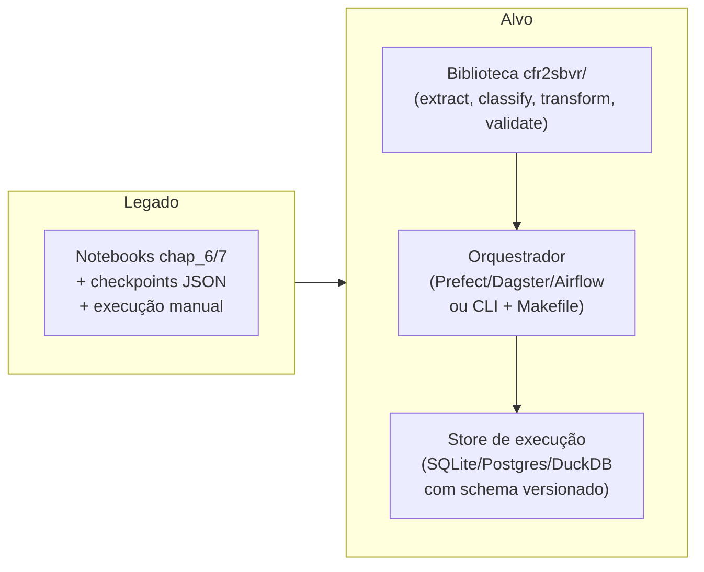
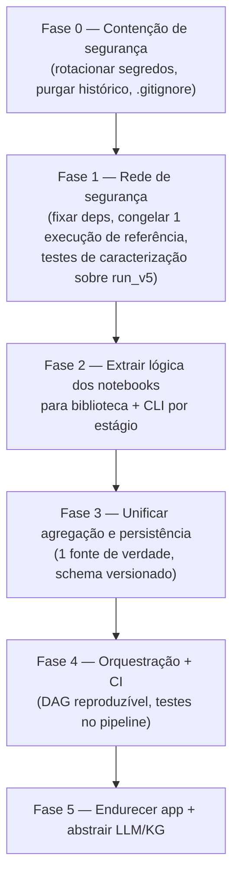

# 06 — Diagnóstico do Legado e Recomendações de Modernização

Este documento consolida os achados dos anteriores em um **diagnóstico acionável**. Ele não impõe uma
arquitetura-alvo; propõe alavancas, riscos e uma sequência de migração, para que a equipe decida com
base em evidências.

> Contexto essencial: este é **código de pesquisa** que sustentou uma dissertação de mestrado (o
> produto real era a *dissertação*, não o software). Isso explica — sem justificar para produção — a
> escolha de notebooks, o estado por arquivos e a ausência de testes. A modernização deve preservar o
> **comportamento científico validado** (o pipeline e suas métricas) enquanto reconstrói a
> **engenharia** em volta dele.

## 1. Diagnóstico de dívida técnica

### 1.1 🔴 Crítico (resolver antes de qualquer coisa)

| # | Achado | Evidência | Risco |
|---|--------|-----------|-------|
| C1 | **Segredos versionados** | senha AG Cloud `GYL6N1KPB4R4xdWKIZqrYw` e host real em `config.yaml`; senhas em scripts | Vazamento de credencial de produção |
| C2 | **Chave OpenAI possivelmente em `.env` versionável** | `.env` presente no working dir | Uso indevido/custo |
| C3 | **Sem testes automatizados** | ausência de `tests/`, `pytest`, CI de qualidade | Regressões silenciosas ao refatorar |

### 1.2 🟠 Alto (bloqueiam produtização)

| # | Achado | Evidência | Impacto |
|---|--------|-----------|---------|
| A1 | **Lógica de negócio dentro de notebooks** | `chap_6_*`, `chap_7_*` | Não testável/automatizável; difícil de versionar (diffs de `.ipynb`) |
| A2 | **Lógica de agregação duplicada** (Python vs SQL) | `DocumentProcessor` × `db_objects_v*` | Divergência silenciosa entre app e pipeline |
| A3 | **Duas versões de processo (v4/v5)** paralelas | bancos e views duplicados | Manutenção dobrada; ambiguidade de "verdade" |
| A4 | **Sem orquestração** | execução manual notebook-a-notebook | Não reproduzível de forma confiável |
| A5 | **Provider de taxonomia duplicado** | `src/rules_taxonomy_provider` × `cfr2sbvr_inspect/rules_taxonomy_provider` | Divergência de comportamento |
| A6 | **Dependências não fixadas no pipeline** | `requirements.txt` sem versões (só o app fixa) | Builds não reprodutíveis |

### 1.3 🟡 Médio (qualidade e robustez)

| # | Achado | Evidência |
|---|--------|-----------|
| M1 | Chave de documento `"id|type"` frágil a `|` embutido | `checkpoint.restore_from_file` |
| M2 | `content: Any` sem schema versionado por `type` | `Document.content` |
| M3 | `logging.basicConfig` chamado em vários módulos | `checkpoint`, `llm_query`, `app_modules` |
| M4 | SQL montado por f-string com valores de UI | `app_modules.load_data`, `display_section` (baixo risco por ser read-only, mas má prática) |
| ~~M5~~ | ~~`now_as_xsd_dateTime` **definida duas vezes** em `app_modules.py` (a 2ª sobrescreve a 1ª)~~ ✅ **Resolvido** — removida a definição morta (versão hora local); mantida a versão UTC com anotação `-> str` | `app_modules.py` (era l.639 e l.836; agora única em l.833) |
| M6 | `get_databases`/nomes de arquivo divergentes (`database_v5.db` vs `cfr2sbvr_v5.db` no `.env.example`) | `app_modules.get_databases`, `.env.example` |
| M7 | CORS/XSRF desabilitados no devcontainer | `.devcontainer/devcontainer.json` |
| M8 | Multi-provider declarado mas só OpenAI usado | `requirements.txt` (`anthropic`, `google-generativeai`) |
| M9 | `CONTRIBUTTING.md` com nome errado (link do README aponta para `CONTRIBUTING.md`) | raiz de `code/` |

### 1.4 🟢 Pontos fortes a preservar

- **Saída de LLM validada por schema** (`instructor` + Pydantic) — padrão moderno, manter.
- **Separação em módulos de apoio** (`configuration`, `checkpoint`, `llm_query`, etc.) — boa base para
  extrair a lógica dos notebooks.
- **Determinismo do LLM** (`temperature=0`) e **medição de custo/tempo** por chamada.
- **Rastreabilidade regulatória**: cada regra mantém `referenceSupportsMeaning` até o parágrafo do CFR.
- **Metodologia de validação dupla** (SEMSCORE + LLM-judge) com análise estatística — ativo científico.
- **Uso de `defusedxml`** no conversor XSD (consciência de segurança pontual).

## 2. Arquitetura-alvo (opções)

O objetivo é transformar "notebooks + arquivos" em um **serviço de pipeline reproduzível** com um
**app de revisão** e um **KG** como saída. Três blocos, decidíveis independentemente:

### 2.1 Pipeline

Passos:
1. **Extrair a lógica dos notebooks** para funções puras na biblioteca (uma por estágio), reusando os
   módulos existentes. Notebooks viram *finos* (só chamam a lib) ou são substituídos por CLI.
2. **Unificar a agregação**: escolher **uma** fonte de verdade (recomendação: mover a junção do
   `DocumentProcessor` para SQL/DuckDB *ou* eliminar as views e servir o app pela lib) — não manter as
   duas.
3. **Adotar um orquestrador** para reprodutibilidade (mesmo um `Makefile`/CLI com DAG simples já
   resolve o A4). Prefect/Dagster se quiser observabilidade e retries.
4. **Substituir checkpoints-por-data** por um store com schema (as tabelas `RAW_*` já sugerem o
   modelo). Manter export JSON como artefato, não como fonte de verdade.

### 2.2 Persistência
- **Curto prazo:** manter DuckDB (local) / MotherDuck (cloud) — já funciona e é barato.
- **Schema explícito:** versionar o formato de `content` por `type` (Pydantic models já existem para
  isso; falta *persistir* a versão do schema junto do dado).
- **KG:** avaliar se AllegroGraph permanece (lock-in Franz) ou migrar para alternativa
  (GraphDB, Blazegraph, Oxigraph, ou Neo4j+n10s). A escolha depende de haver necessidade de
  **busca vetorial nativa** (hoje um diferencial usado do AG).

### 2.3 App de inspeção
- É o artefato mais próximo de produção (deps fixadas, config via secrets/env). **Manter Streamlit**
  é razoável; endurecer: reativar XSRF, parametrizar SQL, remover a 2ª definição de
  `now_as_xsd_dateTime`, unificar o provider de taxonomia com o do pipeline.

### 2.4 Abstração de LLM
- Introduzir uma **interface de provider** (já há `instructor`, que suporta múltiplos backends) para
  destravar `anthropic`/`gemini`/modelos locais e reduzir lock-in OpenAI. Centralizar em `llm_query`.
- Externalizar os **prompts** (hoje strings dentro dos notebooks, versionadas como `system_prompt_v1..v4`)
  para arquivos versionados (`prompts/*.md`) com registro da versão usada em cada execução.

## 3. Sequência de migração recomendada (incremental, sem "big bang")

- **Fase 0 (dias):** resolve C1–C2. Independe de tudo.
- **Fase 1 (rede de segurança):** antes de refatorar, criar **testes de caracterização** — congelar as
  saídas de `run_v5` como *golden* e garantir que a refatoração as reproduz. Isso resolve C3
  parcialmente e protege as fases seguintes.
- **Fase 2:** mover, um estágio por vez, o corpo dos notebooks para funções testáveis. O gabarito e
  `run_v4/v5` servem de oráculo.
- **Fase 3:** eliminar A2 (duplicação de agregação) e migrar o estado para um schema explícito.
- **Fase 4:** orquestrador + CI (lint, testes, build reproduzível).
- **Fase 5:** app e abstrações de fornecedor.

## 4. Decisões que exigem o dono do produto

Estas não podem ser inferidas do código — precisam de decisão de negócio/pesquisa:

1. **v4 vs v5:** qual semântica de encadeamento é o comportamento oficial? (afeta o que se testa e
   materializa) — ver [03-funcional.md §8](03-funcional.md#8-versões-de-processo-v4-vs-v5).
2. **AllegroGraph:** manter (busca vetorial nativa, lock-in Franz) ou migrar?
3. **Escopo de produção:** o alvo é (a) reproduzir a pesquisa com robustez, ou (b) generalizar para
   **outras Partes/Títulos do CFR** e outros corpora? A generalização muda o design de dados.
4. **Multi-LLM:** há requisito de trocar de provedor (custo/soberania de dados)?
5. **Streamlit** permanece como interface de SME ou vira um app web pleno?

## 5. Checklist rápido de "primeira semana"

- [ ] Rotacionar senha AG Cloud e chave OpenAI; confirmar `.env` no `.gitignore`.
- [ ] Purgar segredos do histórico git (`git filter-repo`).
- [ ] Substituir segredos em `config.yaml`/scripts por placeholders + env.
- [ ] Fixar versões em `code/requirements.txt` (usar `requirements-ipt-cfr2sbvr-freeze-env.txt` da raiz como referência).
- [ ] Congelar `run_v5` como *golden* e escrever 1 teste de caracterização ponta-a-ponta.
- [ ] Escolher e registrar a decisão v4-vs-v5.
- [x] ~~Corrigir a duplicação de `now_as_xsd_dateTime`~~ (feito) — e unificar o `rules_taxonomy_provider` (pendente).
- [ ] Documentar a decisão sobre AllegroGraph.

---

### Referências cruzadas
- Componentes e fluxos: [01-arquitetura.md](01-arquitetura.md)
- Serviços, segredos e ambientes: [02-infraestrutura.md](02-infraestrutura.md)
- Pipeline funcional e validação: [03-funcional.md](03-funcional.md)
- Estruturas de dados: [04-modelo-de-dados.md](04-modelo-de-dados.md)
- Glossário: [05-glossario-e-dominio.md](05-glossario-e-dominio.md)
